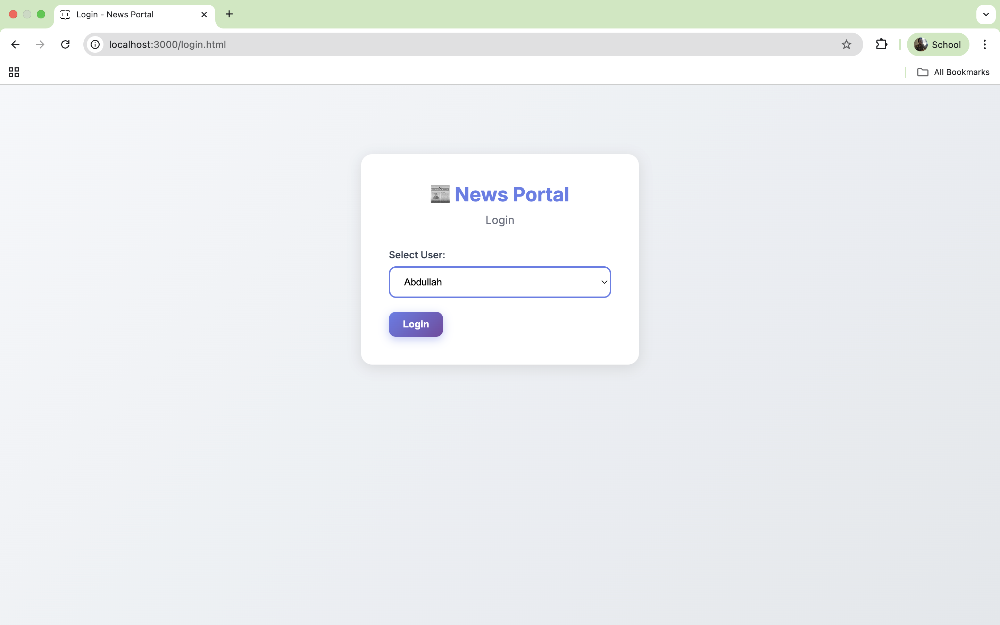
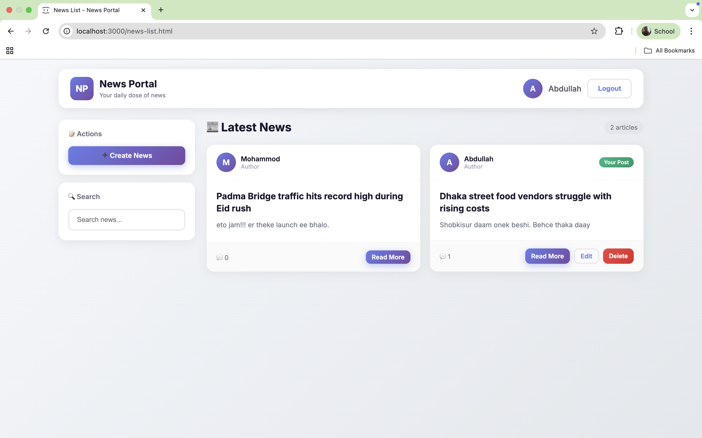
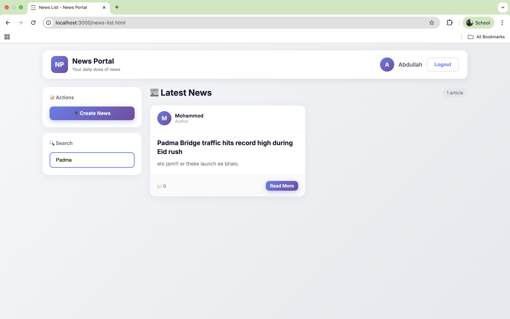
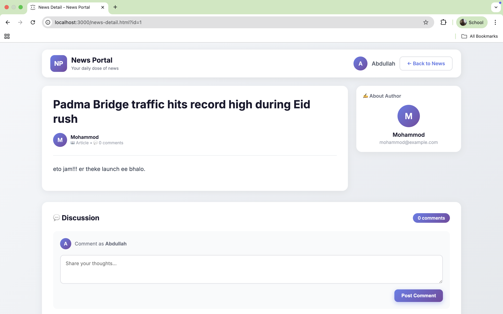
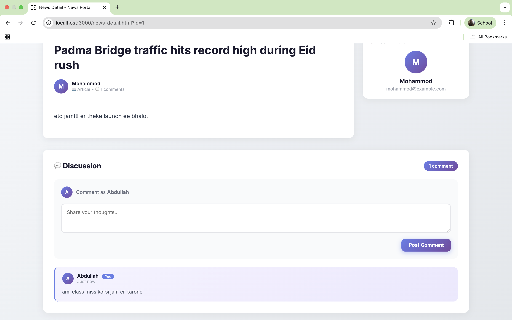
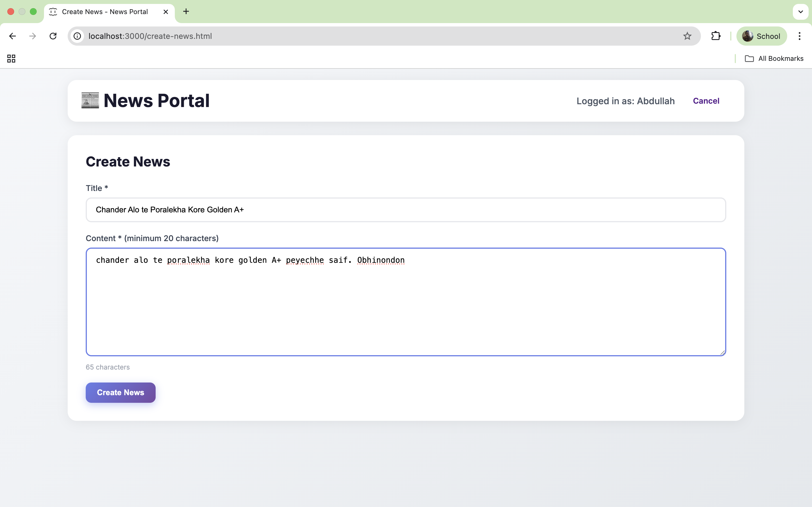
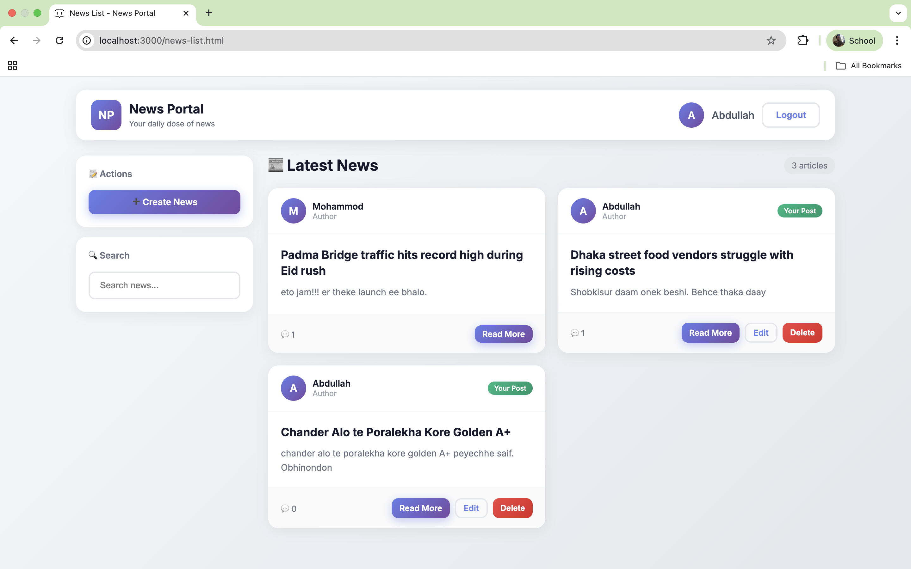

# News Portal

A simple news portal demo that uses json-server and Express to serve static pages and a small JSON-based API (see `db.json`).

## Screenshots

Below are screenshots illustrating the main pages and features of the project.

### Login Page

*Login screen for the news portal.*

### News List (Feed)

*List of news items (feed).*

### Search News

*Search interface for finding news items.*

### News Details

*Detail view for a single news article.*

### Comment on News

*Adding and viewing comments on a news item.*

### Create News

*Form to create a new news item.*

### Feed Update 

*Example of the feed update after adding a new news.*

---

